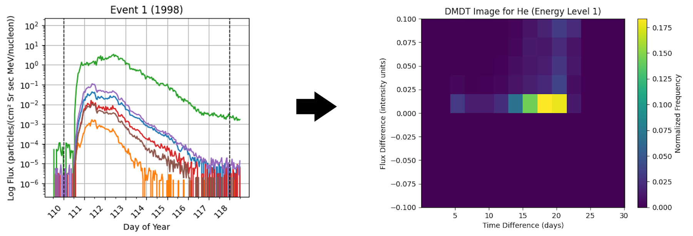
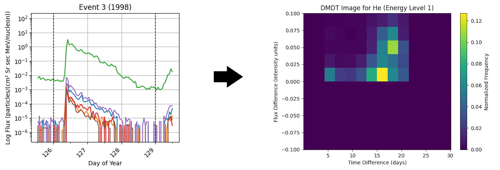
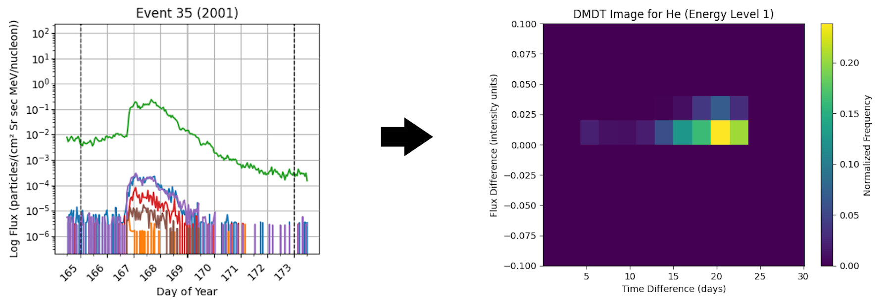
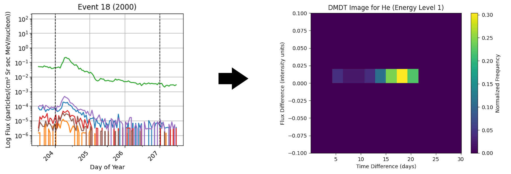
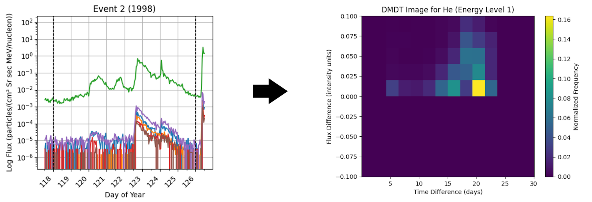

# Solar Energetic Particles Analysis with time-series imaging (DMDT Mappings)

Solar Energetic Particles (SEPs) are a significant phenomenon in space weather research, as they are not only capable of disrupting infrastructure on Earth, but also provide insights into solar phenomena through their ionic charge states. All flux data collected by the Solar Isotope Spectrometer aboard NASA's ACE orbiter, courtesy of the ACE Science Center at Caltech.

Although instruments like NASA’s Solar Isotope Spectrometer (SIS) aboard the Advanced Composition Explorer (ACE) do not directly measure ionic charge states, these states can be inferred if an energy-dependence exists within the time decay constants of SEP event profiles. These profiles can also yield info on the types of particle accelerations present. (Sollitt et al. (2008)).

Current methods for extracting decay profiles for charge state inference involve manual and semi-automated algorithms that are time-consuming and prone to implicit bias. To solve this, we leverage machine learning techniques, specifically Multilayer Perceptrons (MLP) combined with time-series analysis methods, as well as time-series imaging techniques, such as DMDT or Gramian Angular Fields, for use with training Convolutional Neural Networks (CNNs) for classification.

---

This repository contains the codebase and data for the study of decay event categorizations using **DMDT (Δt-ΔF) mappings**. DMDT mappings provide a visual and computational framework for analyzing solar energetic particle (SEP) decay events. By transforming time and flux differences into 2D histograms, this method offers a compact representation of decay dynamics, enabling classification and analysis of various decay types.  

Unfortunately, the full project code cannot be released.

## Project Structure

```
.
├── flux_1998/                          # Contains flux data from 1998-present
├── flux_2014/                          # Contains flux data from 2014-present
├── out_img/                   
├── transformed_data/          
├── ALG_decay_analysis_1998.ipynb       # Algorithmic analysis notebook
├── DMDT_decay_analysis_1998.ipynb      # DMDT analysis notebook
├── GAF_decay_analysis_1998.ipynb
├── graph.py                            # Utilities for graph generation
├── identification.py                   # Decay identification scripts
├── load.py                             # Data loading scripts
├── preprocessing_1998.ipynb            # Preprocessing pipeline for 1998 data
└── README.md
```


## Advanced Methods for Decay Type Categorization (DMDT Mappings)

**DMDT (Δt-ΔF) mappings** are a technique designed to transform raw flux data from decay events into a visual representation that captures the dynamics of flux changes over time. These mappings are represented as 2D histograms where:

- **X-axis:** Differences in time (Δt) between pairs of time points in the decay event.  
- **Y-axis:** Differences in flux (ΔF) between corresponding flux values at those time points.  
- **Color Intensity:** The frequency of occurrence of each \( (Δt, ΔF) \) pair within the event.

### How DMDT Mappings Work

1. **Data Extraction:**  
   Each decay event is characterized by a time series of flux measurements corresponding to specific elements (e.g., Helium) and energy levels. The raw time and flux data for each event are extracted as inputs for the DMDT mapping process.

2. **Pairwise Differences:**  
   All possible pairwise differences between time points (\( t_i, t_j \)) and their corresponding flux values (\( F_i, F_j \)) are calculated. This creates two sets of values:  
   - \( Δt = t_j - t_i \) (time differences)  
   - \( ΔF = F_j - F_i \) (flux differences)  
   These differences represent how the flux evolves over various time intervals within the event.

3. **Binning into Histograms:**  
   The Δt and ΔF values are grouped into discrete intervals (bins). These bins define the resolution of the DMDT mapping and are predefined for consistency across events:  
   - **Time Bins (Δt):** `[0.01, 0.02, 0.04, 0.09, 0.13, 0.17, 0.25, 0.5, 1.1, 2.1, 4.1, 8.1, 15.1, 20.1, 30.1]`  
   - **Flux Bins (ΔF):** `[-0.1, -0.08, -0.06, -0.04, -0.02, 0, 0.02, 0.04, 0.06, 0.08, 0.1]`  
   Each \( (Δt, ΔF) \) pair is assigned to a specific bin based on its value.

4. **Building the 2D Histogram:**  
   A 2D histogram is constructed where the x-axis represents the binned Δt values, the y-axis represents the binned ΔF values, and the color intensity at each grid point corresponds to the frequency of that particular \( (Δt, ΔF) \) pair.

5. **Normalization:**  
   To ensure comparability across events, the histogram is normalized. This step scales the color intensities to emphasize significant patterns while minimizing the influence of absolute differences in flux magnitude or event duration.

The resulting DMDT mappings encapsulate the decay dynamics of each event into a compact visual format. These mappings highlight the dominant patterns in flux and time variations, making them ideal inputs for machine learning algorithms, such as convolutional neural networks (CNNs).


## Example DMDT Mappings

Below are example DMDT mappings for different decay types.

### Exponential Decay Events

**Longer Exponential Decay Event:**



**Shorter Exponential Decay Event:**



Both mappings exhibit high-frequency clusters in similar regions, highlighting that the decay shape (exponential in this case) is the primary differentiator, regardless of event duration or signal-to-noise variations.

### Power-Law Decay Events

**Longer Power-Law Decay Event:**



**Shorter Power-Law Decay Event:**



As with exponential decay, the mappings for power-law decays show consistency in high-frequency clusters, reflecting the underlying decay shape.

### Irregular Decay Events

Irregular events often consist of multiple short periods of exponential-like behavior. Below is a mapping for an irregular decay event:



Despite the complexity of the irregular flux patterns, the mapping reveals similar high-frequency clusters as seen in the mappings for exponential decay events. This suggests that localized exponential behavior contributes significantly to the overall pattern.

## Future Work

DMDT mappings demonstrate promising results in categorizing decay events with consistent shapes. Ongoing work integrates these mappings with **CNNs** for further advancements in classifying complex and irregular SEP events. Additionally, improvements in binning strategies and normalization techniques could enhance the sensitivity and differentiation of the mappings, enabling better handling of composite and irregular patterns.

